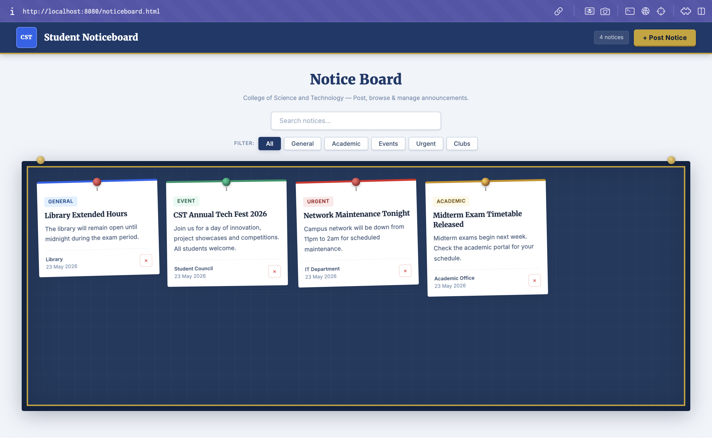
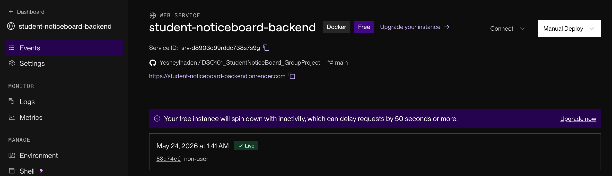
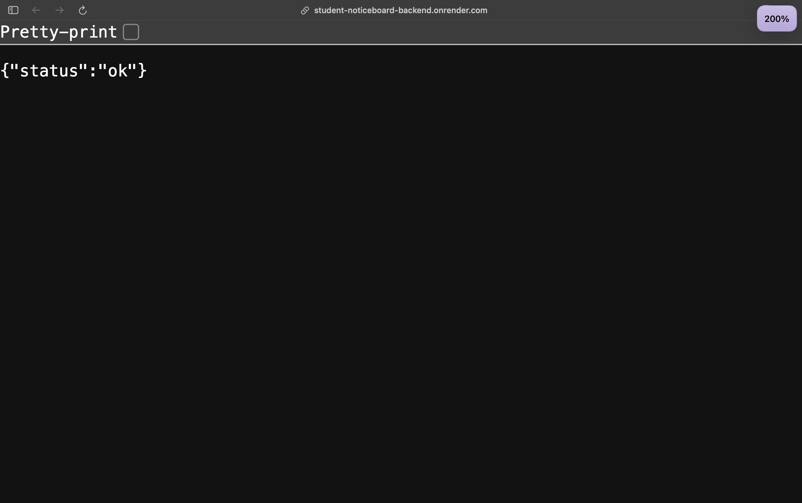
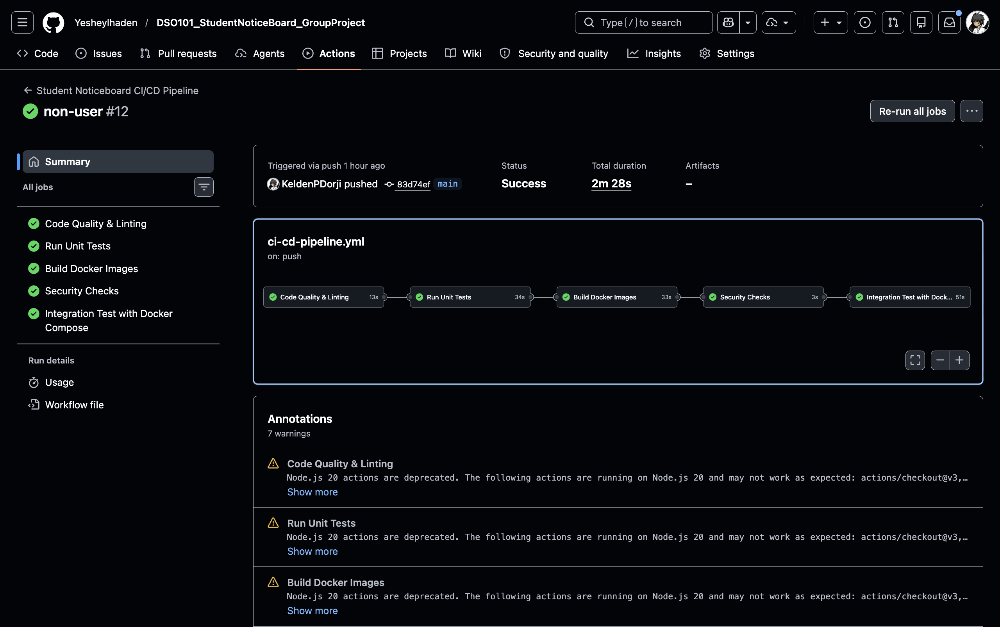
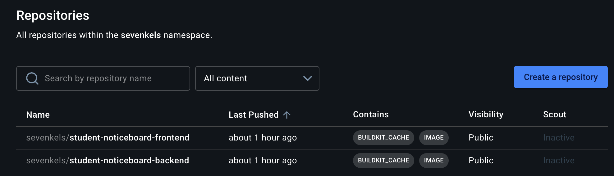

# 📌 Student Noticeboard - DSO101 Group Project

A full-stack containerized web application where students can post, browse, filter, and manage announcements. Built as part of DSO101 to demonstrate modern DevOps practices with CI/CD automation, Docker containerization, and security best practices.

**Team:** Phuntsho Namgyel - Kelden Phuntsho Dorji - Jigme Ngawang Chogyal - Yeshey Lhaden

**Live Backend:** https://student-noticeboard-backend.onrender.com

## Application



The noticeboard lets students post, search, filter by category, and delete announcements. All data persists in PostgreSQL and is served through a REST API. The frontend runs in-browser with no framework — plain HTML, CSS, and JavaScript calling the Flask backend directly.

## Architecture

```
BROWSER
   |
   v
FRONTEND (Nginx)          - serves HTML/CSS/JS via volume mount, port 8080
   |
   v  REST API
BACKEND (Flask)           - Python REST API, port 5001
   |
   v  SQL
DATABASE (PostgreSQL 14)  - persistent volume, port 5432 (internal only)
```

All three services run via Docker Compose on a shared network. The database exposes a health check so the backend only starts once PostgreSQL is ready. The frontend is served by Nginx using a read-only volume mount — no image rebuild needed for frontend changes locally.

## Tech Stack

| Layer | Technology |
|---|---|
| Frontend | HTML5 / CSS3 / JavaScript (Vanilla) |
| Backend | Python Flask + SQLAlchemy |
| Database | PostgreSQL 14 |
| Containerization | Docker + Docker Compose 3.8 |
| CI/CD | GitHub Actions |
| Registry | Docker Hub |
| Deployment | Render (backend) |
| Testing | Pytest + pytest-cov |
| Linting | Flake8, Black |

## Project Structure

```
DSO101_StudentNoticeBoard_GroupProject/
├── .github/
│   └── workflows/
│       └── ci-cd-pipeline.yml
├── backend/
│   ├── app.py
│   ├── requirements.txt
│   ├── Dockerfile
│   └── tests/
│       ├── __init__.py
│       └── test_app.py
├── frontend/
│   ├── noticeboard.html
│   ├── noticeboard.css
│   └── mega.webp
├── screenshots/
├── docker-compose.yml
└── README.md
```

## Quick Start

### Prerequisites

- Python 3.9+
- PostgreSQL 14+
- Docker + Docker Compose

### Run Locally without Docker

```bash
git clone https://github.com/Yesheylhaden/DSO101_StudentNoticeBoard_GroupProject.git
cd DSO101_StudentNoticeBoard_GroupProject/backend

pip install -r requirements.txt
createdb noticeboard
python3 app.py
```

Then open the frontend in a browser directly or serve it:

```bash
cd frontend && python3 -m http.server 8000
# visit http://localhost:8000/noticeboard.html
```

### Run with Docker Compose

```bash
docker-compose up -d        # start all three services
docker-compose logs -f      # stream logs
docker-compose down         # stop services
docker-compose down -v      # stop and delete volumes
```

| Service | URL |
|---|---|
| Frontend | http://localhost:8080/noticeboard.html |
| Backend | http://localhost:5001 |
| Database | internal only (port 5432) |

Note: the frontend file is `noticeboard.html`, not `index.html`, so Nginx will return 403 at the root. Navigate directly to `/noticeboard.html`.

## API

**Local:** `http://localhost:5001`
**Live:** `https://student-noticeboard-backend.onrender.com`



The backend is deployed on Render as a Docker web service, connected to the GitHub repo and auto-deployed on push to `main`. The free instance spins down after inactivity and may take up to 50 seconds to wake.



| Method | Endpoint | Description |
|---|---|---|
| GET | `/health` | Returns `{"status":"ok"}` |
| GET | `/announcements` | Returns all notices ordered by newest first |
| POST | `/announcements` | Creates a new notice |
| PUT | `/announcements/{id}` | Updates an existing notice by ID |
| DELETE | `/announcements/{id}` | Deletes a notice by ID |

### Request Body for POST and PUT

```json
{
  "title": "Notice Title",
  "body": "Notice description",
  "category": "general",
  "author": "Your Name"
}
```

`title`, `body`, and `author` are required. `category` defaults to `general` if omitted.

Valid categories: `general`, `academic`, `event`, `urgent`, `club`

### Example Requests

```bash
# health check
curl https://student-noticeboard-backend.onrender.com/health

# get all notices
curl https://student-noticeboard-backend.onrender.com/announcements

# create a notice
curl -X POST https://student-noticeboard-backend.onrender.com/announcements \
  -H "Content-Type: application/json" \
  -d '{"title":"Exam Timetable","body":"Check the portal.","category":"academic","author":"Academic Office"}'

# delete a notice
curl -X DELETE https://student-noticeboard-backend.onrender.com/announcements/1
```

## CI/CD Pipeline

Every push to `main` triggers the full GitHub Actions pipeline. Pull requests run all stages except the Docker push and integration test.



```
Code Push to main
   |
   v
Stage 1 - Code Quality and Linting    Flake8 (error detection), Black (formatting check)
   |
   v
Stage 2 - Unit Tests                  Pytest against a live PostgreSQL 14 test database
   |
   v
Stage 3 - Build Docker Images         Backend and frontend images built and pushed to Docker Hub
   |
   v
Stage 4 - Security Checks             Scans for hardcoded credentials, verifies non-root USER in Dockerfile
   |
   v
Stage 5 - Integration Tests           Full Docker Compose stack started, /health and /announcements tested
```

The pipeline completed run #12 in 2 minutes 28 seconds with all stages green.

### Docker Hub



Both `sevenkels/student-noticeboard-backend` and `sevenkels/student-noticeboard-frontend` are public repositories on Docker Hub. Images are tagged with branch name, commit SHA, and `latest` on every successful push to `main`.

### GitHub Secrets Required

```
DOCKER_USERNAME   - Docker Hub username
DOCKER_PASSWORD   - Docker Hub personal access token
```

Never commit credentials directly. All sensitive values are stored as GitHub repository secrets and injected at runtime by the workflow.

## Testing

```bash
cd backend

# run all tests with verbose output
pytest tests/ -v

# run with coverage report
pytest tests/ -v --cov=. --cov-report=html

# open coverage report
open htmlcov/index.html
```

The test suite spins up with a dedicated PostgreSQL test database (`noticeboard_test`) and covers the health endpoint, all CRUD operations, input validation, and category enforcement. Coverage reports are uploaded to Codecov on every pipeline run.

## Security

The project follows several security practices throughout:

Non-root containers - the backend Dockerfile creates a dedicated `appuser` and switches to it before running the app, preventing container escape via root privileges.

No hardcoded secrets - all database credentials and Docker Hub tokens are passed via environment variables locally and GitHub Secrets in CI. The pipeline explicitly scans for hardcoded password patterns on every run and fails if any are found.

SQL injection protection - all database queries go through SQLAlchemy ORM using parameterized queries. Raw string concatenation is never used.

Input validation - every endpoint validates required fields and rejects unknown categories with a 400 response before touching the database.

Read-only volume mount - the frontend directory is mounted into Nginx as `:ro`, preventing any write access to frontend files from inside the container.

CORS enabled - `flask-cors` allows the frontend to call the API from any origin, which is required since the frontend and backend run on different ports.